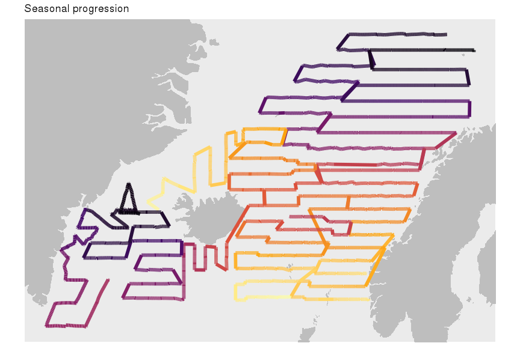
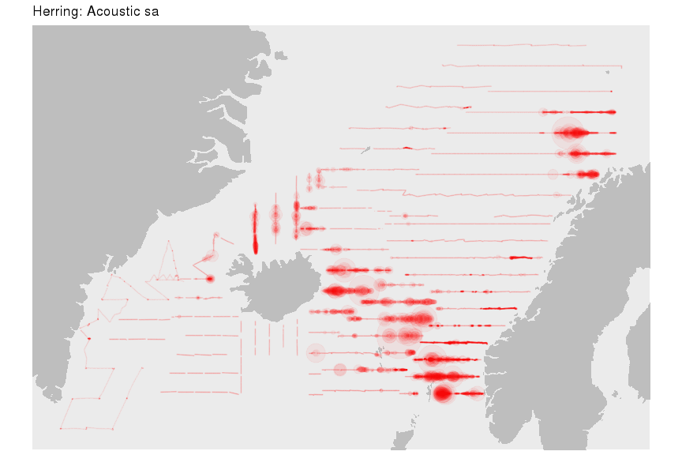
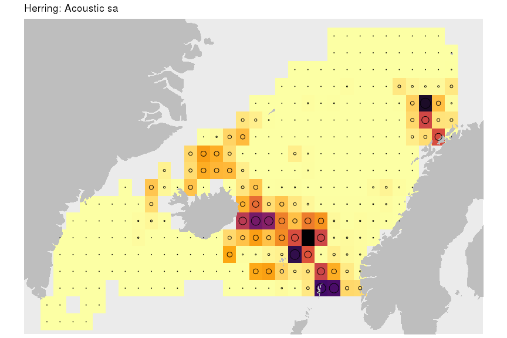
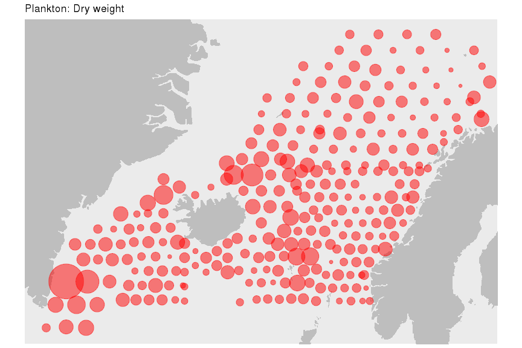

# napr

To establish a connection via R you need to have a a specific back-end for the database that you want to connect to (applies also here). A good starting of what this is all about with additional linkage to useful resources is [Databases using dplyr](https://db.rstudio.com/dplyr).

Installing:

```r
devtools::install_github("fishvice/napr", dependencies = FALSE)
```

Shaking hands with North-Atlantic Pelagic Ecosystem Surveys data

```r
library(ROracle)
library(napr)
library(tidyverse)
```

```r
con <- nap_connect(username = "youshouldknow", password = "youshouldknow")
```

Generic access to tables can then be established via:
```r
nap_tbl(con, "survey")
nap_tbl(con, "logbook")
nap_tbl(con, "catch")
nap_tbl(con, "acoustic")
nap_tbl(con, "biology")
nap_tbl(con, "hydrography")
nap_tbl(con, "plankton")
nap_tbl(con, "acousticvalues")
nap_tbl(con, "species")
...
```

There is also a convenient call for the logbook called nap_logbook and more may be added at later stages.

The nap_logbook function converts the variables lon, lat, day, hour and min from character to numeric values. A function arguement create_date is also available and if set true (default is false) it returns a datetime-variable (called date) from the time associated variables when "possible".

An example for generating a query:
```r
q <-
  nap_logbook(con) %>% 
  left_join(nap_catch(con)) %>% 
  filter(year %in% c(2014:2017),
         month %in% c(7, 8), 
         species == "MAC") %>% 
  mutate(catch = ifelse(is.na(catch), 0, catch)) %>% 
  select(year, lon, lat, catch)
```


```r
q
```

```
## # Source:   lazy query [?? x 4]
## # Database: OraConnection
##     year    lon   lat    catch
##    <dbl>  <dbl> <dbl>    <dbl>
##  1  2014  11.0   75.5  855.   
##  2  2014   9.06  76.1    2.61 
##  3  2014   9.09  75.5 1122.   
##  4  2014   7.01  75.5 2168.   
##  5  2014   6.72  76.1    0.477
##  6  2014 -24.3   64.5  398    
##  7  2014 -25.7   65.2 5073    
##  8  2014 -27.1   65.8 3392    
##  9  2014 -26.3   66.3   27    
## 10  2014 -24.3   66.3  594.   
## # ... with more rows
```

So we actually have an sql-query. Lets now "download" / import the whole data set into R:


```r
d <- 
  q %>% 
  collect(n = Inf)
glimpse(d)
```

```
## Observations: 951
## Variables: 4
## $ year  <dbl> 2014, 2014, 2014, 2014, 2014, 2014, 2014, 2014, 2014, 20...
## $ lon   <dbl> 11.03909, 9.06360, 9.09128, 7.01033, 6.72053, -24.34900,...
## $ lat   <dbl> 75.47341, 76.09642, 75.49991, 75.49790, 76.12370, 64.536...
## $ catch <dbl> 855.160, 2.612, 1122.226, 2168.198, 0.477, 398.000, 5073...
```

And do a quick plot:


```r
xlim <- range(d$lon)
ylim <- range(d$lat)
m <- map_data("world", xlim = xlim, ylim = ylim)
d %>% 
  ggplot() +
  geom_polygon(data = m, aes(long, lat, group = group), fill = "grey") +
  geom_point(aes(lon, lat, size = catch), colour = "red", alpha = 0.4) +
  scale_size_area(max_size = 10) +
  facet_wrap(~ year) +
  coord_quickmap(xlim = xlim, ylim = ylim) +
  scale_x_continuous(NULL, NULL) +
  scale_y_continuous(NULL, NULL) +
  labs(title = "Mackerel catch")
```

<!-- -->

The beauty with this interface is that we write code in R, but since the connection is to a database (happens to be Oracle in this case) all the code is automatically transferred to sql. Take e.g. this:

```r
library(ROracle)
library(napr)
library(tidyverse)
spec_list <- c("MAC","HER","LUM","SAL", "WHB")

con <- nap_connect("youshouldknow", "youshouldknow")
nap_tbl(con, "biology") %>%
  filter(year == 2018,
         species %in% spec_list) %>%
  left_join(nap_survey(con)) %>%
  filter(survey == "IESSNS") %>%
  group_by(species) %>%
  summarize(maxl = max(length))
```
... gives:
```
Joining, by = c("country", "vessel", "cruise", "year")
# Source:   lazy query [?? x 2]
# Database: OraConnection
  species  maxl
  <chr>   <dbl>
1 HER      40  
2 LUM      49.5
3 MAC      48.5
4 SAL      80  
5 WHB      41  
Warning message:
Missing values are always removed in SQL.
Use `MAX(x, na.rm = TRUE)` to silence this warning 
```

I.e. in the above code we let the Oracle do all the work for us. Even the output is still just from the query - just showing the top rows, which in this specific case is all of it. If one where to use the above analysis further within R one would just call `collect`. One could however also use the query further within Oracle with some additional sql-acrobatics via the dplyr-package.

Lets do some more plots:

```r
nap_tbl(con, "acoustic") %>% 
  filter(year == 2017,
         month %in% c(7, 8)) %>% 
  collect(n = Inf) %>% 
  mutate(date = lubridate::ymd_hms(paste0(year, "-", month, "-", day, " ", hour, ":", min, ":00"))) %>% 
  arrange(vessel, date) %>% 
  ggplot() +
  geom_polygon(data = m, aes(long, lat, group = group), fill = "grey") +
  geom_path(aes(aclon, aclat, colour = as.numeric(date), group = vessel), lwd = 2) +
  scale_x_continuous(NULL, NULL) +
  scale_y_continuous(NULL, NULL) +
  coord_quickmap(xlim = xlim, ylim = ylim) +
  scale_colour_viridis_c(option = "B", direction = -1) +
  theme(legend.position = "none") +
  labs(title = "Seasonal progression")
```

<!-- -->

```r
d <-
  nap_tbl(con, "acoustic") %>% 
  filter(year == 2017,
         month %in% c(7, 8)) %>% 
  left_join(nap_tbl(con, "acousticvalues") %>% 
              filter(species == "HER")) %>% 
  mutate(sa = ifelse(is.na(sa), 0, sa)) %>% 
  collect(n = Inf)
d %>% 
  ggplot() +
  geom_polygon(data = m, aes(long, lat, group = group),
               fill = "grey") +
  geom_point(aes(aclon, aclat, size = sa),
             colour = "red", alpha = 0.05) +
  scale_size_area(max_size = 20) +
  coord_quickmap(xlim = xlim, ylim = ylim) +
  scale_x_continuous(NULL, NULL) +
  scale_y_continuous(NULL, NULL) +
  theme(legend.position = "none") +
  labs(title = "Herring: Acoustic sa")
```

<!-- -->

```r
d %>% 
  mutate(aclon = gisland::grade(aclon, 2.0),
         aclat = gisland::grade(aclat, 1.0)) %>% 
  group_by(aclon, aclat) %>% 
  summarise(sa = mean(sa, na.rm = TRUE)) %>% 
  ggplot() +
  geom_raster(aes(aclon, aclat, fill = sa)) +
  geom_polygon(data = m, aes(long, lat, group = group),
               fill = "grey") +
  geom_point(aes(aclon, aclat, size = sa),
             colour = "black", shape = 1) +
  coord_quickmap(xlim = xlim, ylim = ylim) +
  scale_fill_viridis_c(option = "B", direction = -1) +
  scale_size_area() +
  scale_x_continuous(NULL, NULL) +
  scale_y_continuous(NULL, NULL) +
  theme(legend.position = "none") +
  labs(title = "Herring: Acoustic sa")
```

<!-- -->

```r
nap_tbl(con, "plankton") %>% 
  left_join(nap_logbook(con) %>% 
              filter(year == 2017, 
                     month %in% c(7, 8))) %>% 
  collect(n = Inf) %>% 
  mutate(sumdrywt = replace_na(sumdrywt, 0)) %>% 
  ggplot() +
  geom_polygon(data = m, aes(long, lat, group = group),
               fill = "grey") +
  geom_point(aes(lon, lat, size = sumdrywt),
             colour = "red", alpha = 0.5) +
  scale_size_area(max_size = 20) +
  coord_quickmap(xlim = xlim, ylim = ylim) +
  scale_x_continuous(NULL, NULL) +
  scale_y_continuous(NULL, NULL) +
  theme(legend.position = "none") +
  labs(title = "Plankton: Dry weight")
```

<!-- -->
