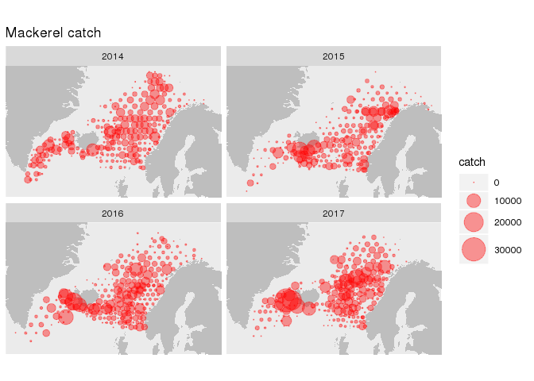

# napr

Installing:
```r
devtools::install_github("fishvice/napr")
```

Shaking hands with North-Atlantic Pelagic Ecosystem Surveys data

```r
library(ROracle)
library(napr)
library(tidyverse)
```

Establishing a connection (you need to have odbc for ROracle installed on your computer):

```r
con <- nap_connect(username = "youshouldknow", password = "youshouldknow")
```

Generic access to tables can then be established via:
```r
nap_tbl(con, "logbook")
nap_tbl(con, "catch")
nap_tbl(con, "acoustic")
nap_tbl(con, "biology")
nap_tbl(con, "hydrography")
nap_tbl(con, "plankton")
nap_tbl(con, "acousticvalues")
...
```

There is also a convenient call for the logbook and catch, via the functions nap_logbook and nap_catch.

An example for generating a query:
```r
q <-
  nap_logbook(con) %>% 
  left_join(nap_catch(con)) %>% 
  filter(year %in% c(2014:2017),
         month %in% c(7, 8), 
         species == "MAC") %>% 
  mutate(catch = ifelse(is.na(catch), 0, catch)) %>% 
  select(year, lon, lat, catch)
```


```r
q
```

```
## # Source:   lazy query [?? x 4]
## # Database: OraConnection
##     year    lon   lat    catch
##    <dbl>  <dbl> <dbl>    <dbl>
##  1  2014  11.0   75.5  855.   
##  2  2014   9.06  76.1    2.61 
##  3  2014   9.09  75.5 1122.   
##  4  2014   7.01  75.5 2168.   
##  5  2014   6.72  76.1    0.477
##  6  2014 -24.3   64.5  398    
##  7  2014 -25.7   65.2 5073    
##  8  2014 -27.1   65.8 3392    
##  9  2014 -26.3   66.3   27    
## 10  2014 -24.3   66.3  594.   
## # ... with more rows
```

So we actually have an sql-query. Lets now "download" / import the whole data set into R:


```r
d <- 
  q %>% 
  collect(n = Inf)
glimpse(d)
```

```
## Observations: 951
## Variables: 4
## $ year  <dbl> 2014, 2014, 2014, 2014, 2014, 2014, 2014, 2014, 2014, 20...
## $ lon   <dbl> 11.03909, 9.06360, 9.09128, 7.01033, 6.72053, -24.34900,...
## $ lat   <dbl> 75.47341, 76.09642, 75.49991, 75.49790, 76.12370, 64.536...
## $ catch <dbl> 855.160, 2.612, 1122.226, 2168.198, 0.477, 398.000, 5073...
```

And do a quickplot:


```r
xlim <- range(d$lon)
ylim <- range(d$lat)
m <- map_data("world", xlim = xlim, ylim = ylim)
d %>% 
  ggplot() +
  geom_polygon(data = m, aes(long, lat, group = group), fill = "grey") +
  geom_point(aes(lon, lat, size = catch), colour = "red", alpha = 0.4) +
  scale_size_area(max_size = 10) +
  facet_wrap(~ year) +
  coord_quickmap(xlim = xlim, ylim = ylim) +
  scale_x_continuous(NULL, NULL) +
  scale_y_continuous(NULL, NULL) +
  labs(title = "Mackerel catch")
```

<!-- -->

